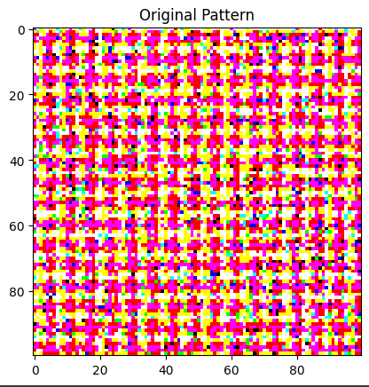

# 🧠 Quantum Visual Patterns with Qiskit

Turn quantum states into stunning pixel art! This project uses quantum circuits to generate images, transforming quantum measurements into RGB colors. Visualize quantum phenomena like superposition and interference through dynamic, algorithmically generated patterns.


---

## 🚀 **Project Overview**
With the power of Qiskit and quantum simulation, this project encodes pixel colors into qubit states. Different quantum gates influence the final color, and by designing various circuit structures, you can create unique, ever-changing images.

🔹 **Superposition:** Qubits exist in multiple states, blending colors probabilistically.  
🔹 **Quantum Interference:** Wave-like interactions generate complex visual patterns.  
🔹 **Measurement Collapse:** The final color emerges when the quantum state is measured.

---

## 🎨 **Pattern Types**
The project supports multiple patterns, each with a distinct quantum flavor:

- **Basic Pixel Pattern:** A direct RGB mapping of qubit states.  
- **Circular Waves:** Radial patterns driven by controlled rotations.  
- **Checkerboard:** Alternating qubit flips for sharp, contrasting grids.  
- **Quantum Words:** Encode text into quantum states and visualize the result.  

| **Circuit**                      | **Pattern Preview**                |
|------------------------------------|------------------------------------|
| `create_simple_pattern_circuite`            |          |
| `create_pattern_circuit('circular')` |    |
| `create_pattern_circuit('waves')`    |          |
| `quantum_pattern_word`              |            |

---

## 🛠 **Installation & Setup**

Clone the repository and install dependencies:

```bash
git clone https://github.com/yourusername/quantum-visual-patterns.git
cd quantum-visual-patterns
pip install -r requirements.txt
```


